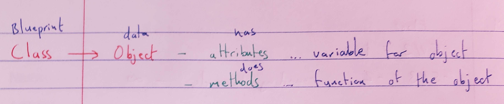

# Day 16 - Object-oriented Programming (OOP)
___
## Concepts Practised
___
- Classes and Objects
- Constructing objects and accessing their attributes and methods
- How to add Python packages and use PyPi (PrettyTable)
- Modifying object attributes and calling methods (`CoffeeMaker.py`)
___

```
Class (blueprint)
{
Object{
Attribute (variables)
Method (functions)
}
}
```

```python
def greet(greeting): #parameter
    print(f"{greeting}")

greet("Hi") #argument
```

