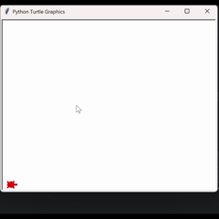

# Day 19 - Instances, State and Higher Order Functions
___
# Concepts Practised
___

- Python Higher Order Functions & Event Listeners
- Higher Order Function: a function taking another function as an input
  - When using documented methods, it's better to use keyword arguments
  - Keyword arguments uses keys within methods `my_function(c=3, a=1, b=2)`, as opposed to positional arguments `my_function(1,2,3`

- Object State and Instances
- The Turtle Coordinate System

## Turtle Race
___
