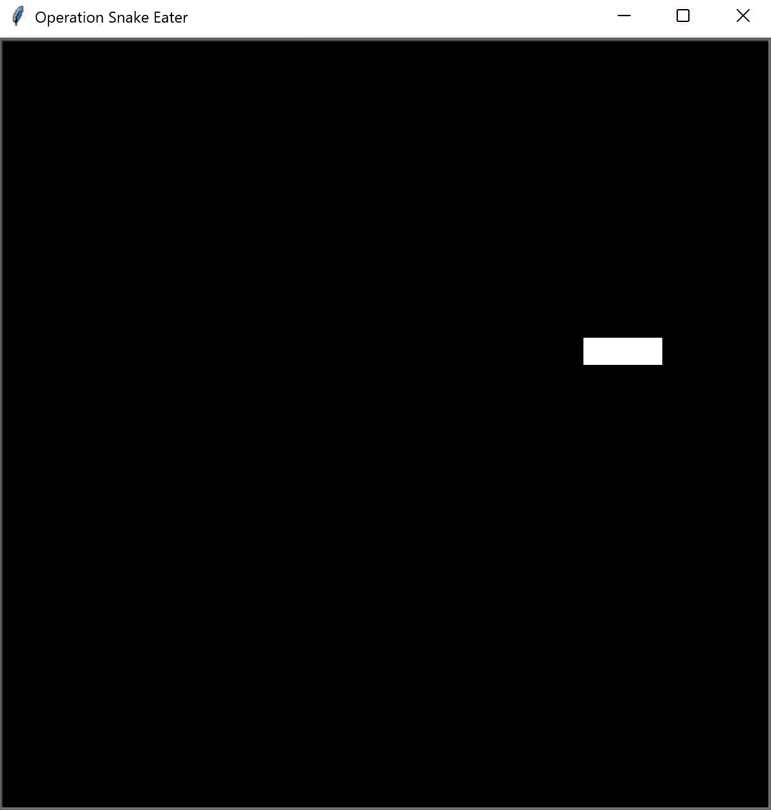

# Day 20 - Build the Snake Game Part 1: Animation & Coordinates
___
## Concepts Practised
___
- Screen Setup and Creating a Snake Body
- Animating the Snake Segments on Screen
- Create a Snake Class & Move to OOP
- How to Control the Snake with a Keypress using event listeners

## Snake Game Part 1
___
