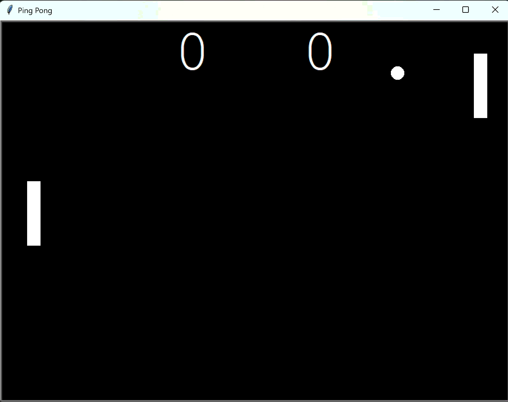

# Day 22 - Build Pong: The Famous Arcade Game
___
## Concepts Practised
___
- Creating the Paddle Class from the Turtle superclass and generating two paddle objects
- Have the paddles respond to key presses via `Event Listeners`
- Creating the Ball Class and making it move
- Adding bouncing logic between the ball and upper and lower walls
- Writing collision detection with the ball and paddle to reflect
- Accounting for ball direction and back pedalling correction
- Detecting when the Ball goes Out of Bounds and resetting position
- Tallying score and changing the ball's speed

`Misc`
CTRL+r: replace

## Ping Pong
___
