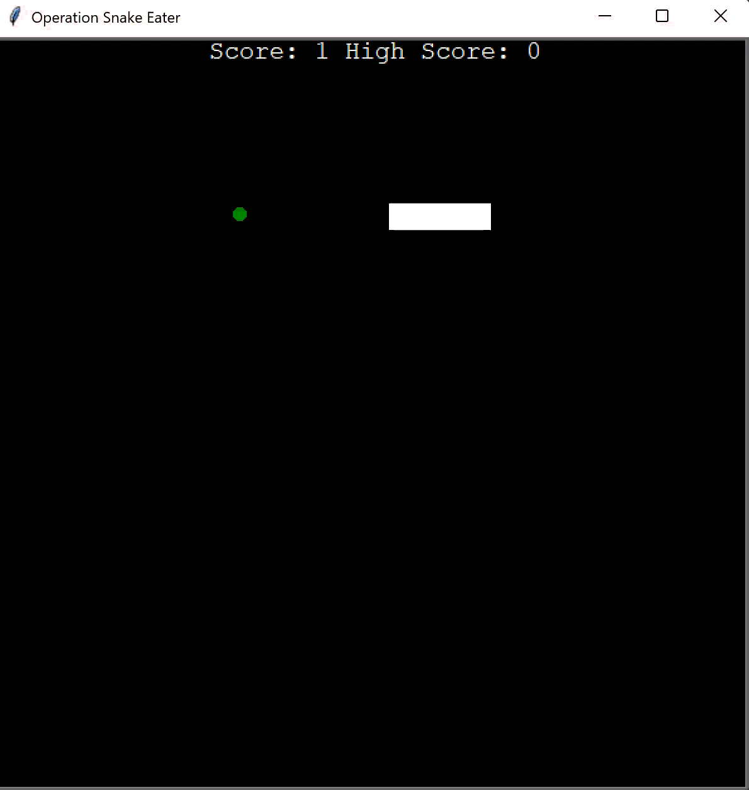

# Day 24 - Files, Directories and Paths
___
## Concepts Practised
___
- How to Open, Read, and Write to Files using the "with" Keyword
- Add a High Score to the Snake Game
```
        with open("data.txt") as data:
            self.high_score = int(data.read())
```
- Save/write `high_score` into the `data.txt` file
- Relative and Absolute File Paths
- Resources:
  - https://docs.python.org/3/tutorial/inputoutput.html#reading-and-writing-files
  - https://www.w3schools.com/python/ref_file_readlines.asp
  - https://www.w3schools.com/python/ref_string_replace.asp
  - https://www.w3schools.com/python/ref_string_strip.asp

## Operation Snake Eater (with High Score saving)
___

## Mail Merger
___


