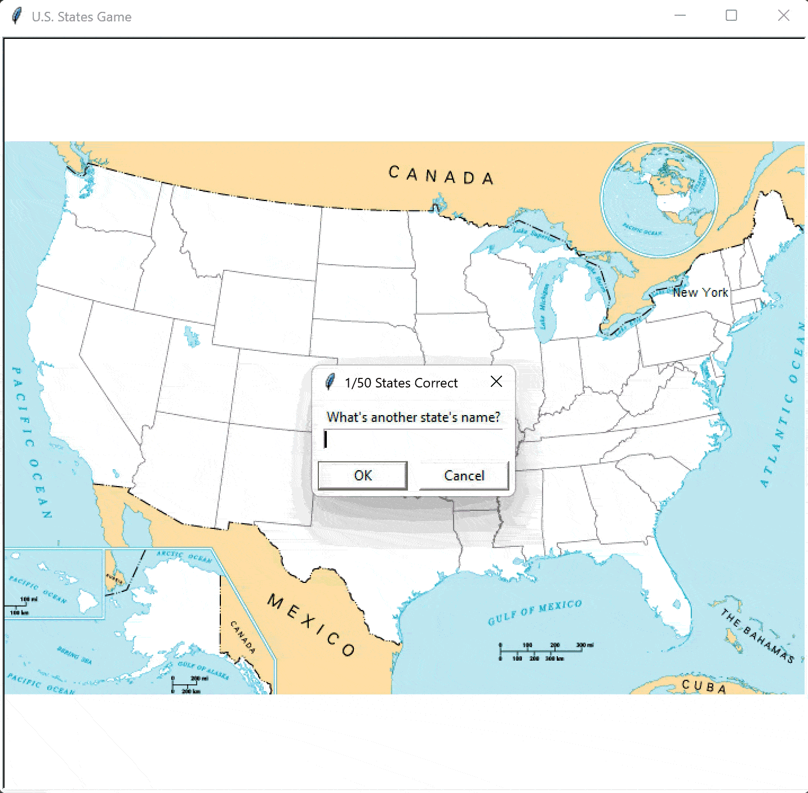

# Day 25 - Working with CSV Data and the Pandas Library
___
## Concepts Practised
___
- Reading CSV Data in Python
- DataFrames & Series
- Working with Rows & Columns
- Data Analysis with Pandas
- How to refactor `mapping.py` as a "Game Engine" and `main.py` as the "Level Loader"
- https://pandas.pydata.org/docs/
- https://pandas.pydata.org/docs/user_guide/10min.html#selection

```python
import pandas as pd
data = pd.read_csv("csv_file.csv")

data_dict = {
    "Trait": [],
    "Count": []
}

# print(data_dict)
df = pd.DataFrame(data_dict)
# print(df)
df.to_csv("csv_file_to_export.csv")
```
| Day | Temp | Condition |
| :--- | :--- | :--- |
| Monday | 12 | Sunny |
| Tuesday | 14 | Rain |
| Wednesday | 15 | Rain |
| Thursday | 14 | Cloudy |
| Friday | 21 | Sunny |
| Saturday | 22 | Sunny |
| Sunday | 24 | Sunny |
```
# Get Data in Rows
print(df[df.day == "Monday"])
print(df[df.temp == df.temp.max()])
```
## U.S. States Game
___

### A note on List Comprehension
___
`missing_state = [state for state in all_locations if state not in guessed_location]`
1. `state` (The Output): This is the very first word in the brackets. It says: "Put this item into my new list."
2. `for state in all_locations` (The Loop): This is the engine. It goes through every single item in your original list of 50 states.
3. `if state not in guessed_location` (The Filter): This is the gatekeeper. It only allows the item to pass through to the output if the user hasn't guessed it yet.

| Standard For Loop                   | List Comprehension                 |
|:------------------------------------|:-----------------------------------|
| `missing_state = []`                | `missing_state = [`                |
| `for state in all_locations:`       | `state for state in all_locations` |
| `if state not in guessed_location:` | `if state not in guessed_location` |
| `missing_state.append(state)`       | `]`                                |

- **Speed:** Under the hood, Python executes list comprehensions slightly faster than .append() loops.
- **Readability:** Once you get used to the syntax, it’s much easier to see at a glance: "I'm making a list of states from all_locations that aren't in guessed_location."
- **Conciseness:** It keeps your main.py clean and focused on high-level logic.
