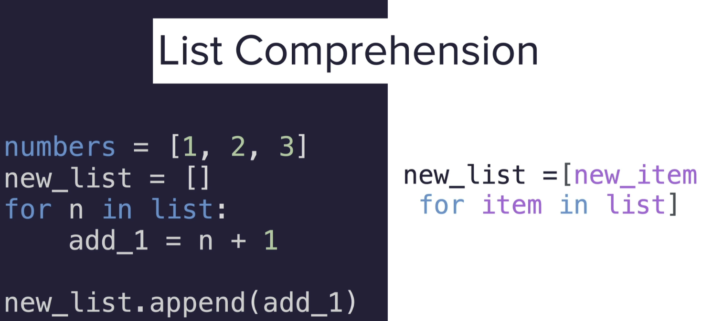
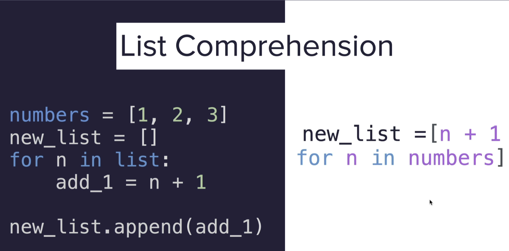
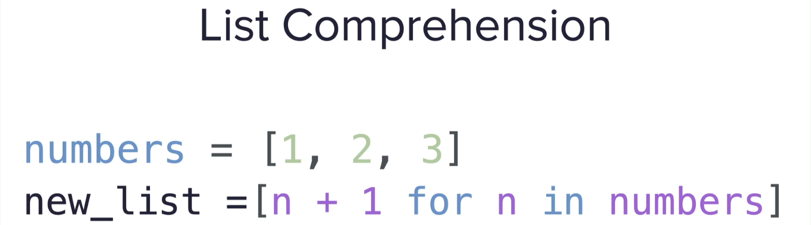
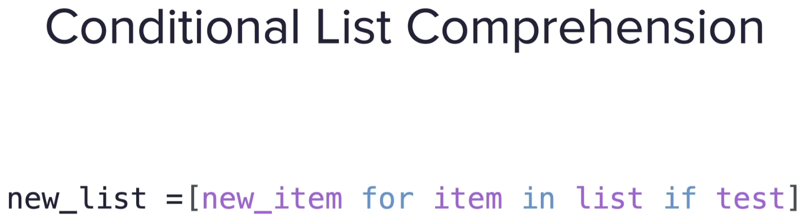
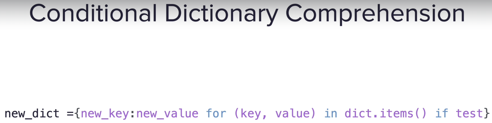
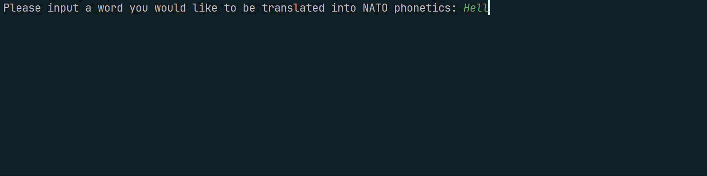

# Day 26 - List Comprehension and the Nato Alphabet
___
## Concepts Practised
___
- How to Create Lists using List Comprehension
- How to use Dictionary Comprehension
- How to Iterate over a Pandas DataFrame

# List Comprehension
___

# Conditional Dictionary Comprehension
___

### Python sequences
___
- list
- range
- string
- tuple

## Nato Alphabet Project
___
