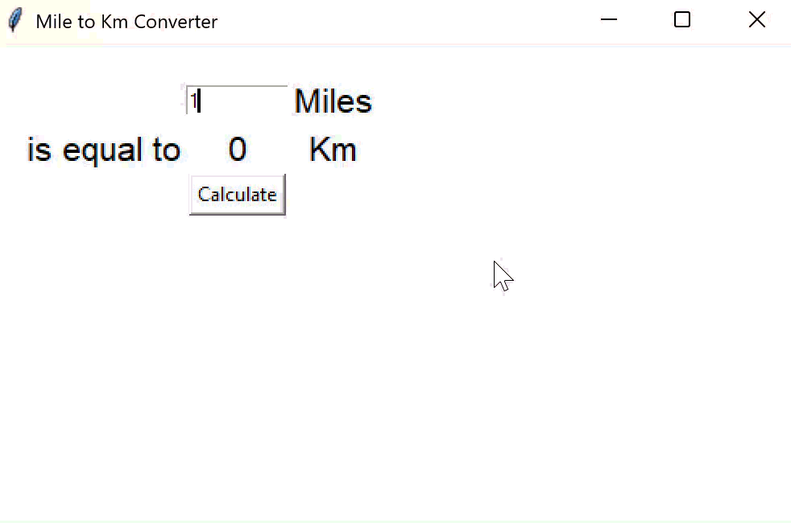

# Day 27 - Tkinter, *args, **kwargs and Creating GUI Programs
___
## Concept Practiced
___
- Creating Windows and Labels with Tkinter
- Setting Default Values for Optional Arguments inside a Function Header
- *args
- **kwargs
- Buttons, Entry, and Setting Component Options
- Other Tkinter Widgets: Radiobuttons, Scales, Checkbuttons and more
- Tkinter Layout Managers: pack(), place() and grid()

## Unlimited Positional Arguments
```py
def add(*args):
    for n in args: # tuple
        print(n)

add(3, 5, 7, 8)
```
`*` asterisk operator collects all the arguments into a tuple

## **kwargs: Many Keyworded Arguments
```py
def calculate(n, **kwargs):
    print(kwargs)
    for key, value in kwargs.items():
        print(key)
        print(value)

    n += kwargs["add"]
    n *= kwargs["multiply"]
    print(n)

calculate(2, add=3, multiply=5)
```

```py
class Car:
    def __init__(self, **kw):
        self.make = kw.get("make") # we use .get to return `None` when appropriate
        self.model = kw.get("model")
        self.colour = kw.get("colour")
        self.seats = kw.get("seats")

my_car = Car(make="Porsche", model="911")
print(my_car.make)
print(my_car.model)
print(my_car.colour)
print(my_car.seats)
```

# Miles to MK Converter


## Misc.
___
- https://docs.python.org/3/library/tkinter.html#the-packer
- https://www.tcl-lang.org/man/tcl8.6/TkCmd/pack.htm
- https://www.tcl-lang.org/man/tcl8.6/TkCmd/entry.htm